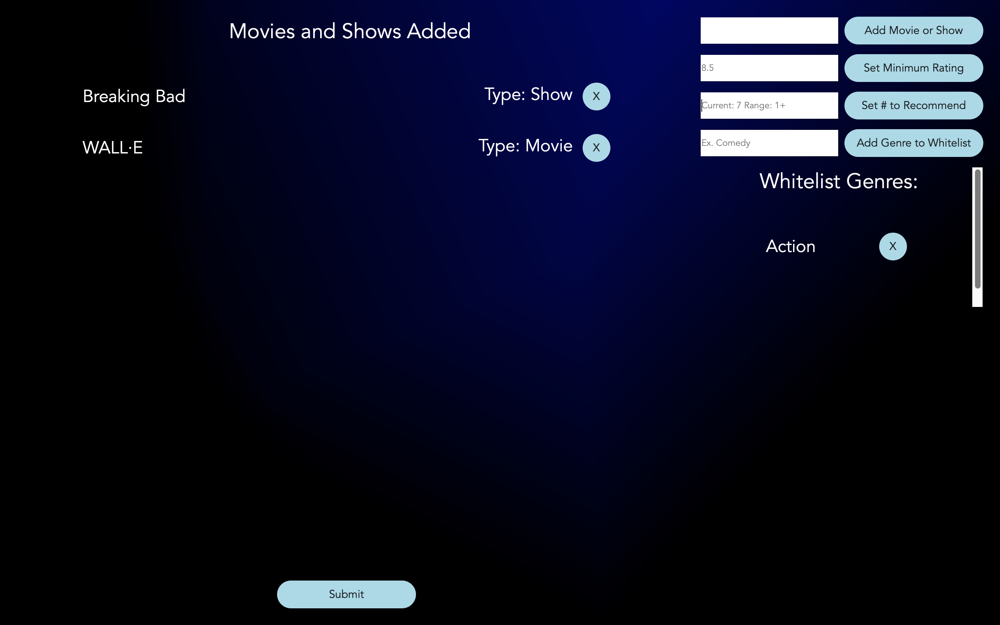
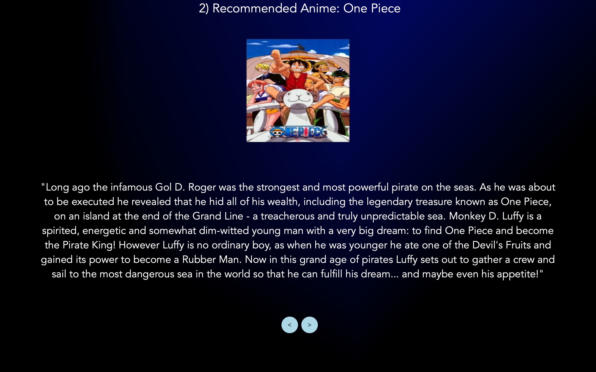

# csc111project: Anime Recommendation Program
```python
developers = ["Jaiz Jeeson", "Ethan Fine", "Carmen Chau", "Jaron Fernandes"]
```
## Downloading Libraries and running main.py
Before we begin, you must download all the .py files and requirements.txt, and move it to the TOP LEVEL of the final csc111project folder. In other words, within the final csc111project folder, there is a datasets folder, an imgs folder (containing images for GUI background) and on the same level, all the .py files and requirement.txt files.

We also highly suggest you create a new virtual environment (venv) to install requirements.txt and necessary packages

Now, in Pycharm’s Python console (inside the project folder), run the command pip install -r requirements.txt. This should load the majority of the packages

Then, open keyword graph maker.py. Uncomment the following lines found in the file to disable SSL checks. We got this code from a StackOverflow answer, please consult our reference list:
```python
import ssl
try:
    _create_unverified_https_context = ssl._create_unverified_context↪→
except AttributeError:
    pass
else:
    ssl._create_default_https_context = _create_unverified_https_context↪→
```
Next, run keyword graph maker.py (right click, then press ”Run File in Python Console”). You WILL see an error likely titled ”OSERROR: [E050]...”. We will resolve this in subsequent steps.

Now, in the **Python Console**, please run the following commands to download the nltk dependencies:
```python
import nltk
nltk.download('stopwords')
nltk.download('punkt')
nltk.download('averaged_perceptron_tagger')
nltk.download('wordnet')
wnl = WordNetLemmatizer()
```
Go back to terminal and download the spacy language model we have used.
```pip
pip install -U pip setuptools wheel
pip install -U spacy
```
(line above optional if spacy download ran in requirements.txt)
```pip
python -m spacy download en_core_web_lg
```
Now, you should have all required packages to test out our individual .py files and run main.py. You should COMMENT OUT the SSL code you used to download the nltk packages PRIOR to running keyword graph maker.py again or running main.py. In general, unless you need to download the packages again, keep the SSL code commented out.

## What you should expect from main.py:
After running main.py, you should expect to see a window pop up with two sections: a section that holds the movies and shows you’ve in and a section that holds all the widgets used to customizable the recommendation program. Please note that to properly set one of the settings, you need to click on the button beside it. If it’s valid, it will appear somewhere as a list or as placeholder text, depending on the specific setting. After selecting your settings and adding movies and shows, you can press the ”Submit” button below to start generating recommendations. This will take some time and will appear to ”freeze”, but depending on your filters and number of shows/movies you’ve added, it will take some time.

If you want to test main.py quickly (a few seconds), you should run it with a small input of movies/shows (1 or 2), and with a few filters (ex. rating: 8.5, genre: comedy and/or drama).





